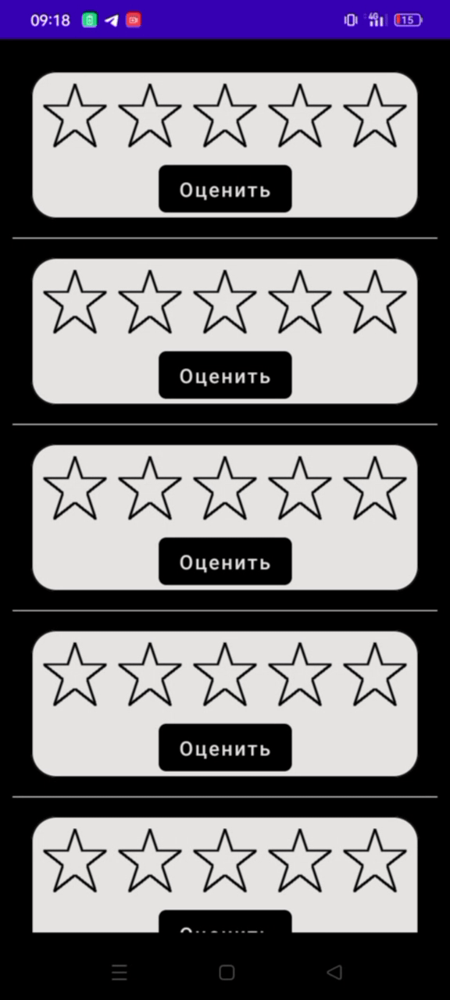

# VK CUP 22/23 Отборочный этап

Весь UI реализован на Jetpack Compose, при написании использовались только стандартные библиотеки Compose.

![Survey] ![Match items]
![Edit in skip place] ![Drag in skip place]
![Stars]
